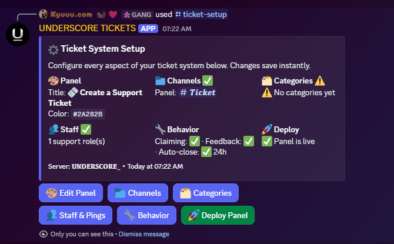
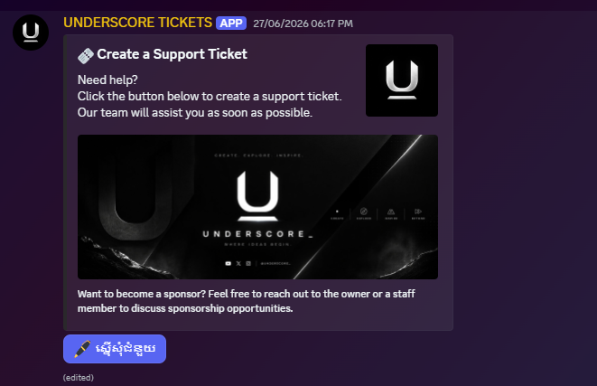
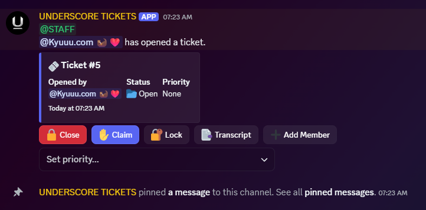
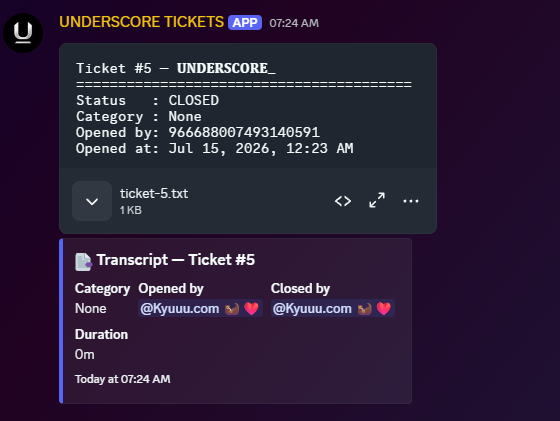
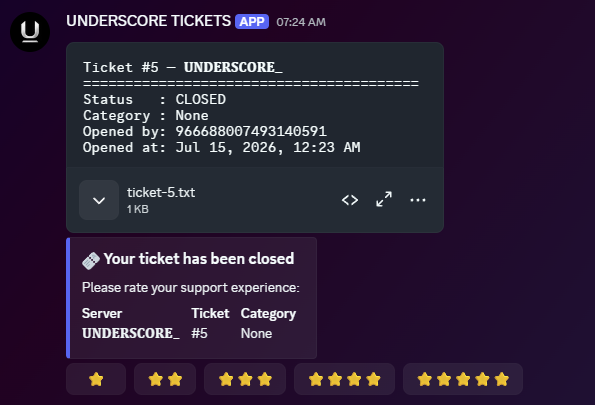
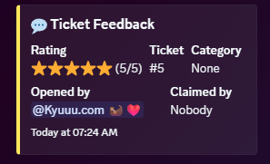

# 🎫 Ultimate Ticket Bot

> A fully customizable Discord support ticket system with an interactive, in-server setup dashboard.

Configure the entire system with one slash command—`/ticket-setup`. Customize the ticket panel, channels, categories, staff access, pings, and ticket behavior directly in Discord. Settings are stored per server in MongoDB and persist across restarts.

## ✨ Features

- **Interactive setup dashboard** — configure the bot without editing source files or restarting it.
- **Custom ticket panel** — edit the title, description, color, footer, author, thumbnail, image, button label, and button emoji.
- **Ticket categories** — create multiple ticket types with custom names, emojis, descriptions, and up to two intake questions.
- **Channel routing** — select the panel channel, ticket category, archive category, transcript/log channel, and feedback channels.
- **Staff and pings** — assign support roles and choose which roles or users are notified when a ticket opens.
- **Ticket controls** — close, claim or unclaim, lock or unlock, download a transcript, add or remove members, and set priority.
- **Plain-text transcripts** — generate downloadable `.txt` transcripts on demand and automatically when a ticket closes.
- **Customer feedback** — ask the ticket creator for a 1–5 star rating by DM and post the result to configured feedback channels.
- **Automatic cleanup** — optionally close inactive tickets after a configurable number of hours.
- **Flexible close behavior** — delete or archive closed tickets and optionally lock them on close.
- **Custom channel names** — build names with `{username}`, `{userid}`, `{number}`, and `{category}` tokens.
- **Centralized emoji branding** — change the bot's interface emojis from `emojis.json`.
- **Per-server configuration** — every Discord server has its own persistent settings.

## 📸 How It Works

### 1. Configure the ticket system

Run `/ticket-setup` with the **Manage Server** permission. The private dashboard summarizes the current configuration and provides controls for the panel, channels, ticket categories, staff and pings, behavior, and deployment. Changes save immediately.



### 2. Deploy the support panel

Customize the support message, select a panel channel, and choose **Deploy Panel**. Members can then use the panel button to begin opening a ticket.



### 3. Manage the ticket

When a member opens a ticket, the bot creates a private channel and posts its control panel. Staff can close, claim, lock, generate a transcript, add members, or select a priority.



### 4. Save the transcript

Closing a ticket creates a downloadable text transcript and posts a summary containing the category, ticket creator, closing staff member, and duration to the configured logs channel.



### 5. Collect feedback

If feedback is enabled, the ticket creator receives the transcript and a direct message asking them to rate their support experience from one to five stars.



### 6. Review the result

The submitted rating is posted to the configured feedback channel with the ticket number, category, creator, and claimed staff member.



## 🚀 Getting Started

### Prerequisites

- [Node.js](https://nodejs.org/) 18 or newer
- A [MongoDB](https://www.mongodb.com/) database, either local or hosted
- A Discord application and bot token from the [Discord Developer Portal](https://discord.com/developers/applications)

### Installation

1. Clone the repository:

   ```bash
   git clone https://github.com/yuuslokrobjakkroval/ultimate-ticket-bot.git
   cd ultimate-ticket-bot
   ```

2. Install the dependencies:

   ```bash
   npm install
   ```

3. Create your environment file:

   ```bash
   cp .env.example .env
   ```

   On Windows PowerShell, use:

   ```powershell
   Copy-Item .env.example .env
   ```

4. Add your credentials to `.env`:

   ```env
   BOT_TOKEN=your_bot_token_here
   CLIENT_ID=your_application_client_id
   MONGODB_URI=mongodb://localhost:27017/ticket-bot
   ```

5. Invite the bot to your Discord server with the `bot` and `applications.commands` scopes. Give it the permissions required to view and manage ticket channels, messages, roles, and attachments.

6. Start the bot:

   ```bash
   npm start
   ```

   For development with automatic restarts:

   ```bash
   npm run dev
   ```

## 🛠️ Setup Guide

After the bot is online:

1. Run `/ticket-setup` in your Discord server.
2. Select **Edit Panel** to customize the public ticket message.
3. Select **Channels** to configure the panel, ticket, archive, logs, and feedback destinations.
4. Select **Categories** to add the ticket types members can choose from.
5. Select **Staff & Pings** to configure support access and notifications.
6. Select **Behavior** to configure claiming, feedback, automatic closing, close behavior, ticket limits, and channel naming.
7. Select **Deploy Panel** when the dashboard shows the required configuration is ready.

> The setup dashboard is ephemeral, so only the administrator who runs the command can see it.

## ⚙️ Behavior Reference

| Setting | Default | Description |
| --- | --- | --- |
| Claiming | On | Allows staff to claim and unclaim tickets |
| Feedback | On | Sends the ticket creator a 1–5 star rating request after closing |
| Auto-close | Off | Automatically closes tickets after a period of inactivity |
| Auto-close time | 48 hours | Inactivity period used when auto-close is enabled |
| Delete on close | Off | Deletes closed ticket channels instead of moving them to the archive category |
| Lock on close | Off | Prevents new messages in a closed ticket |
| Max open tickets | `1` | Maximum simultaneous open tickets per member |
| Naming format | `ticket-{username}` | Template used for new ticket channel names |

### Channel naming tokens

| Token | Value |
| --- | --- |
| `{username}` | Ticket creator's Discord username |
| `{userid}` | Ticket creator's Discord user ID |
| `{number}` | Ticket number |
| `{category}` | Selected ticket category name |

## 📁 Project Structure

```text
ultimate-ticket-bot/
├── assets/                 # README screenshots
├── src/
│   ├── commands/           # Slash commands
│   ├── components/
│   │   ├── setup/          # Interactive setup dashboard
│   │   └── ticket/         # Ticket lifecycle and controls
│   ├── events/             # Discord.js event handlers
│   ├── handlers/           # Command, event, and component loaders
│   ├── models/             # MongoDB/Mongoose schemas
│   ├── utils/              # Transcripts, permissions, and auto-close
│   └── index.js            # Application entry point
├── .env.example
├── emojis.json             # Interface emoji configuration
└── package.json
```

## 🔧 Tech Stack

- [Discord.js](https://discord.js.org/) v14
- [Mongoose](https://mongoosejs.com/) v8
- [Node.js](https://nodejs.org/)

## 👤 Author

Created by **yuuslokrobjakkroval**.

| Platform | Link |
| --- | --- |
| Discord | [yuuslokrobjakkroval](https://discord.com/users/966688007493140591) |
| GitHub | [yuuslokrobjakkroval](https://github.com/yuuslokrobjakkroval) |
| X / Twitter | [yuuslokrobjakkroval](https://twitter.com/yuuslokrobjakkroval) |
| Instagram | [yuuslokrobjakkroval](https://instagram.com/yuuslokrobjakkroval) |
| TikTok | [yuuslokrobjakkroval](https://tiktok.com/@yuuslokrobjakkroval) |
| YouTube | [yuuslokrobjakkroval](https://youtube.com/@yuuslokrobjakkroval) |

## 📄 License

This project is licensed under the MIT License.

---

<div align="center">
  Built by <strong>yuuslokrobjakkroval</strong>
</div>
